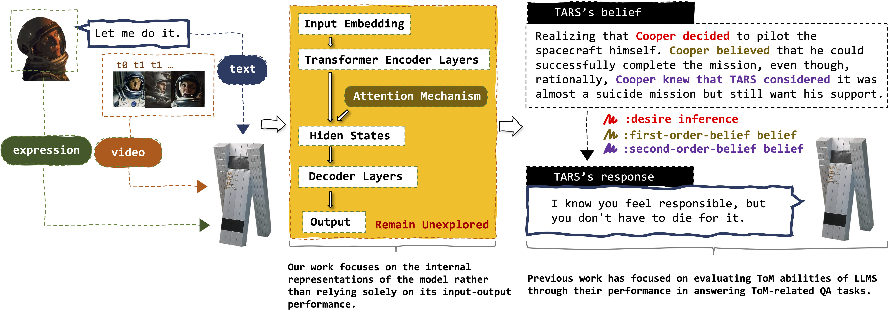

<div align="center">
    
    <h2>From Black Boxes to Transparent Minds: Evaluating and Enhancing the Theory of Mind in Multimodal Large Language Models</h2>
    <p align="center">
    <div style="line-height: 3;">
        <a href="https://annaisavailable.github.io/index.html" target="_blank">Xinyang Li</a><sup>*</sup>,
        <a href="https://scholar.google.com/citations?user=8hceDf0AAAAJ" target="_blank">Siqi Liu</a><sup>*</sup>,
        <a href="https://scholar.google.com/citations?user=Cb29A3cAAAAJ" target="_blank">Bochao Zou</a><sup>†</sup>,
        <a href="https://scholar.google.com/citations?user=A1gA9XIAAAAJ" target="_blank">Jiansheng Chen</a>,
        <a href="https://scholar.google.com/citations?user=32hwVLEAAAAJ" target="_blank">Huimin Ma</a><sup>†</sup>
    </div>
    <br>
    <div style="line-height: 3;">
      <a href='https://annaisavailable.github.io/GridToM/' style="text-decoration:none;">
        
      </a>
      <a href="https://arxiv.org/pdf/2506.14224" style="text-decoration:none;">
        
      </a>
      <a href="https://huggingface.co/datasets/AnnaLeee/GridToM" style="text-decoration:none;">
        
      </a>
    </div>
    <div style="line-height: 1.5;">
      <b>University of Science and Technology Beijing</b>
      <br>
      *Indicates Equal Contribution,†Indicates Corresponding Author
    </div>
</div>

## 🏆 Overview

This repository provides the code for the paper [ICML 2025] "From Black Boxes to Transparent Minds: Evaluating and Enhancing the Theory of Mind in Multimodal Large Language Models"

<div style="margin: 30px auto; display: block; text-align: center;">
    <p align="center">
      
    </p>
</div>

## ⚙️ Installation

```
conda create -n gridtom python=3.12
conda activate gridtom
# Please install PyTorch according to your CUDA version.
conda install pytorch torchvision torchaudio pytorch-cuda=12.1 -c pytorch -c nvidia
pip install -r requirements.txt
```

## ⚡️ Quick Start
```
chmod 700 *.sh

./init_belief.sh LLaVA-NeXT-Video-7B-hf
./init_belief.sh Qwen2-VL-7B-Instruct

./evaluate.sh LLaVA-NeXT-Video-7B-hf
./evaluate.sh Qwen2-VL-7B-Instruct

./save_states.sh LLaVA-NeXT-Video-7B-hf
./save_states.sh Qwen2-VL-7B-Instruct

./interv_evaluate.sh LLaVA-NeXT-Video-7B-hf
./interv_evaluate.sh Qwen2-VL-7B-Instruct
```

<!-- Citation -->
## 🔎 Citation

Please cite the paper and star this repo if you find it interesting/useful, thanks!

```bibtex
@article{li2025black,
  title={From Black Boxes to Transparent Minds: Evaluating and Enhancing the Theory of Mind in Multimodal Large Language Models},
  author={Li, Xinyang and Liu, Siqi and Zou, Bochao and Chen, Jiansheng and Ma, Huimin},
  journal={arXiv preprint arXiv:2506.14224},
  year={2025}
}
```

## 🌟 Star History

<a href="https://www.star-history.com/#annaisavailable/GridToM&Date">
 <picture>
   <source media="(prefers-color-scheme: dark)" srcset="https://api.star-history.com/svg?repos=annaisavailable/GridToM&type=Date&theme=dark" />
   <source media="(prefers-color-scheme: light)" srcset="https://api.star-history.com/svg?repos=annaisavailable/GridToM&type=Date" />
   
 </picture>
</a>